# Database schema

This is the effective schema created by the single `0001_init.sql` bootstrap.

For a new Supabase project, run only
`supabase/migrations/0001_init.sql`; it is the complete destructive bootstrap.
Migrations `0002` through `0005` are retained only for upgrading databases that
had already recorded an older version of `0001`.

```mermaid
classDiagram
direction LR

class auth_users {
  uuid id PK
}
class teams {
  uuid id PK
  integer api_football_id UK
  integer football_data_id UK
  text name
  text short_name
  text code
  text country
  text logo_url
  text venue_name
}
class profiles {
  uuid id PK_FK
  text display_name UK
  text avatar_url
  uuid favorite_team_id FK
  text locale
  timestamptz nickname_confirmed_at
  timestamptz accepted_terms_at
}
class groups {
  uuid id PK
  text name
  uuid created_by FK
  text image_url
  integer entry_fee_agorot
  uuid invite_code UK
  text bit_payment_url
  text paybox_payment_url
  text payment_note
}
class group_members {
  uuid group_id PK_FK
  uuid user_id PK_FK
  group_member_role role
  timestamptz joined_at
}
class group_join_requests {
  uuid id PK
  uuid group_id FK
  uuid user_id FK
  group_join_request_status status
  uuid reviewed_by FK
  timestamptz requested_at
  timestamptz reviewed_at
}
class fixtures {
  uuid id PK
  integer football_data_id UK
  integer season
  fixture_stage stage
  text round
  smallint matchday
  timestamptz kickoff_at
  uuid home_team_id FK
  uuid away_team_id FK
  fixture_status status
  smallint home_goals
  smallint away_goals
  numeric prob_home
  numeric prob_draw
  numeric prob_away
  smallint home_win_points
  smallint draw_points
  smallint away_win_points
}
class ai_match_predictions {
  uuid fixture_id PK_FK
  smallint predicted_home_goals
  smallint predicted_away_goals
  smallint home_win_probability
  smallint draw_probability
  smallint away_win_probability
  smallint confidence
  text summary_en
  text summary_he
  jsonb key_factors_en
  jsonb key_factors_he
  jsonb sources
  text model
  jsonb source_snapshot
}
class fixture_recent_form {
  uuid fixture_id PK_FK
  jsonb home_matches
  jsonb away_matches
  jsonb home_lineup
  jsonb away_lineup
  timestamptz fetched_at
}
class fixture_results {
  uuid fixture_id PK_FK
  fixture_status status
  smallint home_goals
  smallint away_goals
  boolean went_to_extra_time
  smallint elapsed_minutes
  timestamptz released_at
}
class fixture_details {
  uuid fixture_id PK_FK
  fixture_status provider_status
  jsonb payload
  timestamptz fetched_at
}
class predictions {
  uuid id PK
  uuid user_id FK
  uuid fixture_id FK
  smallint home_goals
  smallint away_goals
  boolean is_joker
  boolean is_automatic
  text fixture_round
}
class prediction_scores {
  uuid prediction_id PK_FK
  uuid user_id FK
  uuid fixture_id FK
  smallint base_points
  boolean correct_outcome
  boolean correct_goal_difference
  boolean exact_score
  numeric difficulty_multiplier
  numeric stage_multiplier
  numeric joker_multiplier
  smallint total_points
  jsonb breakdown
}
class season_team_candidates {
  integer season PK
  integer candidate_id PK
  integer football_data_id
  uuid team_id FK
  text name_en
  text name_he
  numeric implied_probability
  smallint pick_points
  smallint rank
}
class season_player_candidates {
  integer season PK
  integer candidate_id PK
  integer football_data_id
  uuid team_id FK
  text name_en
  text name_he
  text team_name_en
  text team_name_he
  numeric implied_probability
  smallint pick_points
  smallint rank
}
class season_picks {
  uuid id PK
  uuid user_id FK
  integer season FK
  integer champion_candidate_id FK
  integer top_scorer_candidate_id FK
  smallint champion_pick_points
  smallint scorer_pick_points
  smallint champion_awarded_points
  smallint scorer_awarded_points
  timestamptz settled_at
}
class season_outcomes {
  integer season PK
  uuid champion_team_id FK
  integer_array top_scorer_football_data_ids
  timestamptz released_at
}
class team_squad_players {
  integer season PK
  uuid team_id PK_FK
  text source PK
  text source_player_id PK
  integer football_data_id
  text name
  text position
  smallint shirt_number
}
class game_settings {
  smallint id PK
  smallint exact_points
  smallint outcome_points
  text rules_note_en
  text rules_note_he
  uuid updated_by FK
  text ai_player_name
  text ai_player_avatar_url
}
class provider_poll_state {
  text job PK
  timestamptz last_requested_at
}
class ai_prediction_usage {
  uuid id PK
  text model
  uuid fixture_id FK
  bigint budget_charge_microusd
  bigint estimated_cost_microusd
  integer input_tokens
  integer cached_input_tokens
  integer cache_write_tokens
  integer output_tokens
  smallint web_search_calls
  text status
}
class prediction_automation_config {
  smallint id PK
  timestamptz enabled_at
}

auth_users "1" --> "0..1" profiles : owns
auth_users "1" --> "0..*" groups : creates
auth_users "1" --> "0..*" group_members : joins
groups "1" --> "0..*" group_members : contains
auth_users "1" --> "0..*" group_join_requests : requests_or_reviews
groups "1" --> "0..*" group_join_requests : receives
teams "1" --> "0..*" profiles : favorite_of
teams "1" --> "0..*" fixtures : home_team
teams "1" --> "0..*" fixtures : away_team
fixtures "1" *-- "0..1" fixture_results : private_result
fixtures "1" *-- "0..1" fixture_details : provider_payload
fixtures "1" *-- "0..1" fixture_recent_form : research_input
fixtures "1" *-- "0..1" ai_match_predictions : ai_prediction
fixtures "1" --> "0..*" ai_prediction_usage : usage_charge
auth_users "1" --> "0..*" predictions : submits
fixtures "1" --> "0..*" predictions : receives
predictions "1" *-- "0..1" prediction_scores : settles_to
auth_users "1" --> "0..*" prediction_scores : earns
fixtures "1" --> "0..*" prediction_scores : awards_for
teams "1" --> "0..*" season_team_candidates : candidate
teams "1" --> "0..*" season_player_candidates : player_team
teams "1" --> "0..*" team_squad_players : squad
teams "1" --> "0..*" season_outcomes : champion
auth_users "1" --> "0..*" season_picks : submits
season_team_candidates "1" --> "0..*" season_picks : champion_pick
season_player_candidates "1" --> "0..*" season_picks : scorer_pick
auth_users "1" --> "0..*" game_settings : updates
```

## Relationship rules

- `profiles.id` is also `auth.users.id`, so a profile is the application's one-to-one extension of an Auth user.
- `group_members` has the composite primary key `(group_id, user_id)`. `group_join_requests` separately enforces one request per `(group_id, user_id)`.
- A fixture references `teams` twice: once as home and once as away. Its research, hidden result, details, and AI prediction are optional one-to-one child rows keyed by `fixture_id`.
- `predictions` enforces one row per `(user_id, fixture_id)`. `fixture_round` is deliberately denormalized for the one-joker-per-user-per-round unique index.
- `prediction_scores.prediction_id` makes settlement one-to-one with a prediction; its copied `user_id` and `fixture_id` support fast leaderboard aggregation.
- `season_picks` references both candidate tables with composite foreign keys `(season, candidate_id)`, preventing candidates from another season being selected.
- `prediction_automation_config`, `game_settings`, and `provider_poll_state` are operational singleton/state tables and therefore have no parent relation.
- `fixture_results`, `ai_prediction_usage`, `prediction_automation_config`, and `provider_poll_state` are service-only under RLS. Client-visible data is controlled by the policies in `0001_init.sql`.
- Foreign keys to users generally cascade on user deletion; optional audit references such as `reviewed_by` and `updated_by` become `NULL`. Fixture-owned rows cascade when a fixture is deleted.

## Functional flow

`auth.users -> profiles -> predictions -> prediction_scores` is the player scoring path.  
`teams -> fixtures -> fixture_results -> predictions/prediction_scores` is the match settlement path.  
`season_*_candidates -> season_picks -> season_outcomes` is the tournament-long picks path.
